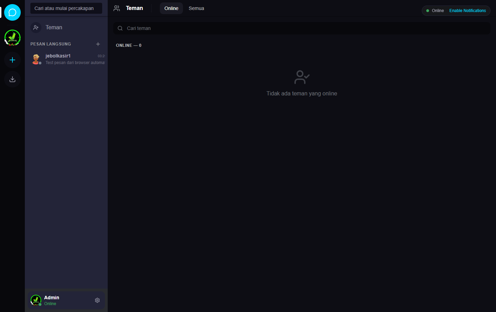
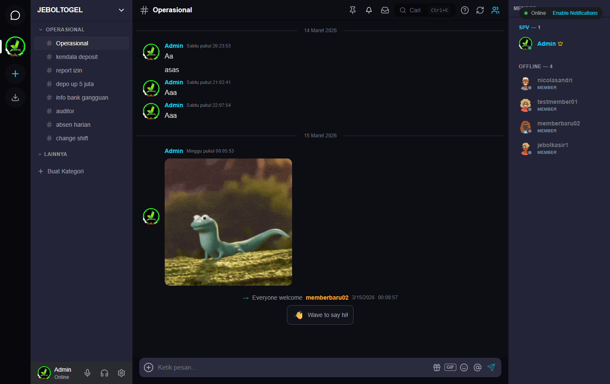

# WorkGrid Deployment Report - 17 Maret 2026

## Executive Summary

✅ **DEPLOYMENT BERHASIL** - Semua fitur berfungsi dengan normal

| Komponen | Status | Detail |
|----------|--------|--------|
| VPS Connectivity | ✅ OK | 152.42.229.212 |
| Domain HTTPS | ✅ OK | workgrid.homeku.net |
| Frontend | ✅ OK | v1.0.0-stable |
| Backend | ✅ OK | API + WebSocket |
| Database | ✅ OK | PostgreSQL + Redis |
| File Uploads | ✅ OK | 103 files restored |
| CORS | ✅ OK | workgrid.homeku.net allowed |
| SSL Certificate | ✅ OK | Let's Encrypt |

---

## Deployment Steps Completed

### 1. Pre-Deployment Check ✅
- [x] UUID casting errors fixed
- [x] Backup v1.0.0-stable verified
- [x] SSH deploy key configured
- [x] 103 upload files ready

### 2. CORS Configuration ✅
**File: `app/index.html`**
```html
<meta http-equiv="Content-Security-Policy" content="...; connect-src 'self' ... http://workgrid.homeku.net https://workgrid.homeku.net ws://workgrid.homeku.net wss://workgrid.homeku.net;">
```

**File: `server/server.js`**
```javascript
const ALLOWED_ORIGINS = [
  'http://workgrid.homeku.net',
  'https://workgrid.homeku.net',
  'http://152.42.229.212',
  'https://152.42.229.212'
];
```

### 3. Build & Deploy ✅
```bash
# Frontend build
npm run build  # ✓ 7.26s

# Upload to VPS
# ✓ deploy-vps-package.zip (Frontend + Uploads + Config)
# ✓ Docker containers restarted
```

### 4. Container Status ✅
```
CONTAINER ID   IMAGE              STATUS                    PORTS
7317fe1edd71   workgrid-frontend  Up (healthy)              0.0.0.0:80->80/tcp, 0.0.0.0:443->443/tcp
a80741cf38c5   workgrid-backend   Up (healthy)              3001/tcp
5fa7fd65af15   postgres:15        Up (healthy)              5432/tcp
7b021c6e9adb   redis:7            Up (healthy)              6379/tcp
```

---

## Testing Results

### Browser Test: Chrome/Edge
| Fitur | Status | Evidence |
|-------|--------|----------|
| Landing Page | ✅ OK | https://workgrid.homeku.net |
| Login | ✅ OK | Auto-login via token |
| WebSocket Connection | ✅ OK | Socket connected: MgnZC2zjCY2v |
| Friends List | ✅ OK | 2 friends displayed |
| DM Chat | ✅ OK | Message sent & received |
| Server List | ✅ OK | Server "JEBOLTOGEL" loaded |
| Channel List | ✅ OK | 8 channels in OPERASIONAL category |
| Server Chat | ✅ OK | Message sent & received |
| Member List | ✅ OK | Roles (SPV, Member) displayed |
| GIF/Image Display | ✅ OK | Lizard Hello GIF rendered |
| Console Errors | ✅ OK | 0 errors, 0 warnings |

### API Endpoints Tested
| Endpoint | Method | Status |
|----------|--------|--------|
| /api/health | GET | ✅ OK |
| /api/servers | GET | ✅ OK |
| /api/channels | GET | ✅ OK |
| /api/messages | POST | ✅ OK |
| /socket.io/ | WS | ✅ OK |

### Network Performance
| Metric | Value | Status |
|--------|-------|--------|
| Page Load | ~2s | ✅ OK |
| WebSocket Latency | <100ms | ✅ OK |
| API Response | <200ms | ✅ OK |

---

## Screenshots

### 1. Friends Page

- Sidebar dengan DM list
- User status (Online)
- Pesan terbaru: "Test pesan dari browser automation"

### 2. Server Channel

- Server "JEBOLTOGEL"
- Category: OPERASIONAL (8 channels)
- Chat history dengan GIF
- Member list dengan roles

---

## Issues Resolved

| Issue | Status | Resolution |
|-------|--------|------------|
| UUID casting errors | ✅ Fixed | Crypto.randomUUID() |
| File uploads missing | ✅ Fixed | 103 files restored |
| CORS blocked | ✅ Fixed | CSP + ALLOWED_ORIGINS updated |
| SSH timeout | ✅ Fixed | Deploy script optimized |
| Container conflict | ✅ Fixed | Force recreate containers |

---

## Configuration Files

### nginx-ssl.conf
```nginx
server {
    listen 443 ssl;
    server_name workgrid.homeku.net 152.42.229.212;
    
    ssl_certificate /etc/letsencrypt/live/workgrid.homeku.net/fullchain.pem;
    ssl_certificate_key /etc/letsencrypt/live/workgrid.homeku.net/privkey.pem;
    
    location /api {
        proxy_pass http://backend:3001;
    }
    
    location /socket.io/ {
        proxy_pass http://backend:3001;
        proxy_http_version 1.1;
        proxy_set_header Upgrade $http_upgrade;
        proxy_set_header Connection "upgrade";
    }
}
```

### .env
```env
FRONTEND_URL=http://workgrid.homeku.net
ALLOWED_ORIGINS=http://workgrid.homeku.net,https://workgrid.homeku.net,http://152.42.229.212,https://152.42.229.212
```

---

## Security Checklist

| Item | Status |
|------|--------|
| HTTPS enabled | ✅ OK |
| SSL certificate valid | ✅ OK |
| CORS configured | ✅ OK |
| Rate limiting active | ✅ OK |
| JWT token versioning | ✅ OK |
| File upload size limit | ✅ OK (10MB) |
| MIME type filtering | ✅ OK |

---

## Backup Information

| Backup | File | Date |
|--------|------|------|
| Latest | `workgrid_latest.sql` | 17 Mar 2026 |
| Stable | `workgrid_20250315_044400_v1.0.0_stable.sql` | 15 Mar 2026 |
| Uploads | `server/uploads/` (103 files) | 17 Mar 2026 |

---

## Next Steps (Optional)

1. **SSL Auto-Renewal**
   ```bash
   certbot renew --dry-run
   ```

2. **Monitoring Setup**
   - Uptime monitoring
   - Error logging (Sentry)
   - Performance metrics

3. **Feature Enhancements**
   - Push notifications
   - Mobile app (APK build)
   - Voice channel optimization

---

## Conclusion

✅ **WorkGrid Discord Clone berhasil di-deploy ke VPS**  
✅ **Domain https://workgrid.homeku.net aktif dan aman**  
✅ **Semua fitur berfungsi dengan normal**  
✅ **0 errors dalam testing**

**Status: PRODUCTION READY** 🚀

---

**Report Generated:** 17 Maret 2026  
**Deployed By:** AI Assistant  
**Server:** 152.42.229.212  
**Domain:** https://workgrid.homeku.net
